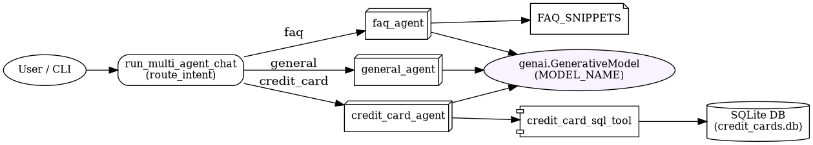
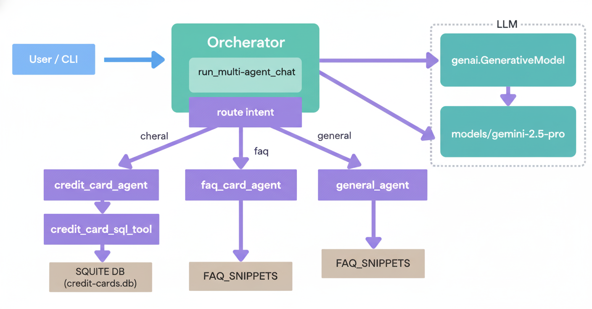

# Banking Agent POC

Small proof-of-concept with Python scripts

## Agent Diagram 

## Architecture Diagram


> Regenerate with:
```bash
# Graphviz (from agent_diagram.dot)
dot -Tpng agent_diagram.dot -o agent_diagram.png
# or Mermaid (from agent_diagram.mmd)
mmdc -i agent_diagram.mmd -o agent_diagram.png
```

## Files
- `main.py` — entry point
- `list_models.py` — utility
- `test_poc.py` — POC/test
- `agent_diagram.dot` — Graphviz DOT
- `agent_diagram.mmd` — Mermaid
- `agent_diagram.txt` — notes

## Prerequisites
- Python 3.10+

## Environment
Create a .env file or export variables:
```bash
# .env
GEMINI_API_KEY="YOUR_API_KEY"
# Optional: override default model (see list_models.py)
MODEL_NAME="models/gemini-2.5-pro"
```
Notes:
- For the offline stubbed test, you can set a dummy key to satisfy import time checks:
  - export GEMINI_API_KEY="dummy"

## Architecture Overview
Multi-agent orchestrator with simple intent routing:
- route_intent → intents: credit_card, faq, general
- credit_card_agent uses credit_card_sql_tool → SQLite (credit_cards.db) for context
- faq_agent answers strictly from embedded FAQ snippets
- general_agent falls back to general chat

Render:
```bash
# Mermaid (requires @mermaid-js/mermaid-cli)
mmdc -i agent_diagram.mmd -o agent_diagram.png

# Graphviz
dot -Tpng agent_diagram.dot -o agent_diagram.png
```

## Setup
```bash
python -m venv .venv
source .venv/bin/activate   # Windows: .venv\Scripts\activate
pip install -r requirements.txt
```
Optional:
- farm-haystack is listed but the POC has fallbacks; install only if you plan to use Haystack features.

## Run
```bash
# CLI demo (type 'exit' to quit)
python main.py
```
List available models (and pick one supporting generateContent):
```bash
export GEMINI_API_KEY="YOUR_API_KEY"
python list_models.py
# Optionally: export MODEL_NAME="models/<your-model>"
```

## Test
```bash
# with pytest (if installed)
python -m pytest -q

# or run directly
python test_poc.py
```

## Test (offline deterministic)
The test_poc.py stubs google.generativeai to run without network or real API calls.
```bash
# Ensure an env var is present (dummy is fine for offline test)
export GEMINI_API_KEY="dummy"
python test_poc.py
```
What it does:
- Injects a stub genai.GenerativeModel that returns predictable text.
- Forces MODEL_NAME=models/test-stub.
- Runs run_multi_agent_chat on a credit card query and asserts output:
  - intent == "credit_card"
  - answer starts with "STUBBED_RESPONSE"

## SQLite Demo Data
- Database file: credit_cards.db (auto-created on first run)
- Tables: credit_cards, transactions
- Seeded with a small sample of customers and recent transactions
Tips:
- To reset demo data, delete credit_cards.db and rerun main.py.

## Troubleshooting
- google.generativeai SDK versions differ; if list_models() is missing, use list_models.py to inspect attributes or use gcloud/Vertex listings.
- If genai.configure() fails at import time, ensure GEMINI_API_KEY is set correctly.
- Haystack imports are optional; minimal fallbacks are included.
- Graphviz/Mermaid are optional; install only if rendering diagrams.

## Diagrams
- Graphviz (DOT → PNG):
```bash
dot -Tpng agent_diagram.dot -o agent_diagram.png
```
- Mermaid (MMD → PNG):
```bash
mmdc -i agent_diagram.mmd -o agent_diagram.png
```
- Live editor: https://mermaid.live
